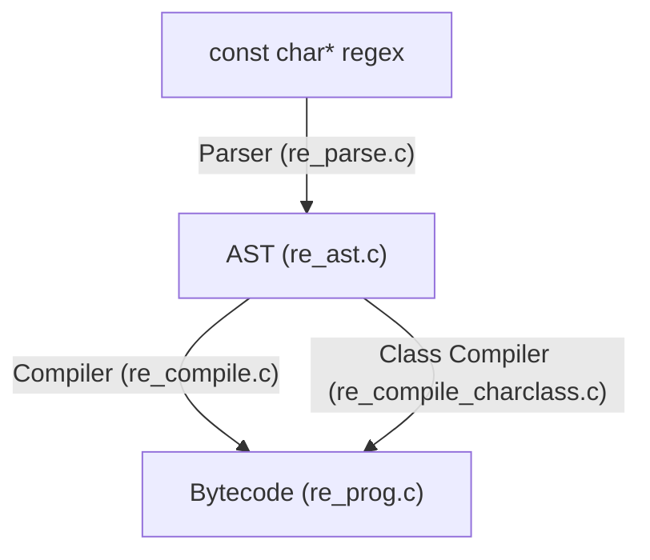
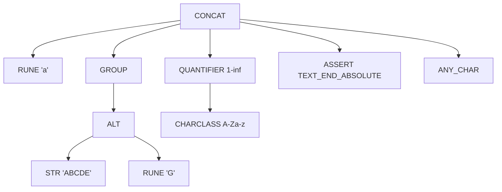

# re

Fast single-header regular expression library implemented in C89. 

```c
re regex;
const char *text;
if (re_init(&regex, "[a-fA-F0-9]*")) {
  /* error */
}
text = "ABC123";
if (re_is_match(&regex, text, strlen(text), RE_ANCHOR_START) == RE_MATCH) {
  printf("Matched!\n");
}
re_destroy(&regex);
```

Features
- Linear-time execution guarantee (non-backtracking)
- Utilizes an NFA for group-search, and a lazy-loaded DFA for bounds-search
- Fully multithread compatible
- Extensively tested (10,000+ lines of tests)
- Unicode compatible (no support for set-based character class notation, otherwise feature-parity with google re2)

Currently, the API is not stable. I am working to develop a version of the API that is flexible enough to offer easy usage in both the single-threaded and the multi-threaded use case.

See `re_api.h` for details on the API.

The design is mostly textbook, but notably contains an implementation for compiling charclasses that is very efficient. I developed an algorithm to compute the state-minimal NFA (in bytecode instruction format) of any set of UTF-8 ranges in linear time. See `re_compile_charclass.c` for more details. To my knowledge this has not been done anywhere else before.

## Architecture

### Frontend

All users of the library access its functionality through the opaque `re` struct. This struct has one member, a pointer to an `re_data` struct. This is not defined in the public API.

This method requires an extra memory allocation for each regex, but greatly simplifies ABI compatibility later down the line.

### Compiler Overview



### `re_parse.c`: the parser

The parser originally was a state-based parser. This is ill-suited for the regular expression syntax, for multiple reasons:

- Regex grammar is really complex. Representing complex grammars with a state machine creates a huge number of confusingly-named states that are hard to decipher
- Regex grammar is actually two separate grammars: base regular expression notation, and character class notation. These grammars are different enough that parsing them requires slightly different techniques and a more advanced state machine, yet they are similar enough (e.g. escape sequences) that separating this parsing completely would be a waste of code.
- Future extensions to the grammar (for example, supporting unicode set notation) would require extensive modification to the state machine.
- Implementing state machines by hand in C is very bug-prone (one has to consider all character possibilities for every state). They are also harder to test in this regard.

For these reasons I felt like the small speed boost to parse a regex in _exactly_ linear time with a state machine was not worth it, and instead chose to rewrite it as a sort of modified recursive-descent parser that parses the string in linear time, with a finite number of backtracks along the way. 

A recursive descent parser is simpler to implement, but carries the added risk of allowing maliciously-crafted regexes to blow out the C stack if the parser is truly recursive. Therefore, my parser uses an explicit stack to track hierarchy in the regex. This has the added benefit of tracking how large the AST's depth will be, which helps the compiler be less complex.

The parser is actually more like three parsers: one for the underlying UTF-8 representation, one for the regex grammar, and one for the character class grammar. This is tough to reconcile with a state machine but the recursive-descent parser handles it pretty well.

The parser outputs to the `re__ast_root` object inside of the `re_data` structure.

### `re_ast.c`: the AST

Here is what the AST of the regex `a(ABCDE|G)[A-Za-z]+\z.` would look like:



#### AST node types

| Type | Description |
| ---- | ----------- |
| RUNE | A character. |
| STR | A string of characters. |
| CHARCLASS | A reference to a character class. |
| CONCAT | Holds multiple nodes in sequence. |
| ALT | Holds an alternation of multiple nodes. |
| QUANTIFIER | Holds a single node which is repeated. |
| GROUP | Holds a single node and group information. |
| ASSERT | An assertion about text positioning (`$^\A\a\B\b\Z\z`) |
| ANY_CHAR | Any character (`.`) |
| ANY_CHAR_NEWLINE | Any character including newlines (`(?s).`) |
| ANY_BYTE | Any byte (`\C`) |

I probably could have gotten away with not using an AST, and just compiling straight from the parser. This would have been a nightmare to code and manage, and my intention with this library was to produce something a bit more understandable for myself.

#### Notes on the AST arena pattern

Traditional ASTs typically are implemented as a structure where all elements are strongly-linked (a `.parent`, `.next_child`, `.previous_child`, maybe even a `.root` pointer for all nodes). In my experience this is really, really tough to do correctly in C. I also added the constraint of having bounded stack depth, and most ways of implementing classical AST structure traversal algorithms in C cant't guarantee this.

My AST solution is to use an arena-type pattern to hold all of the nodes, which are of the type `re__ast`. This arena is managed by a `re__ast_root` object, which controls references between all AST nodes. The nodes themselves hold references to their next sibling, previous sibling, first child, and last child. The references are integers representing the positions in the arena storage array where these nodes occur.

This eliminates entire classes of headache-inducing bugs. Notably, deallocating AST objects is simple: just `free()` the arena. No recursion on pointers to find all the nodes to delete. If we add objects to the arena, the relative positions of other objects in the array do not change.

Getting the contents of an AST node is a little bit more involved: we have to ask the arena for a pointer to the actual node given its reference ID, using the `re__ast_root_get()` function. In addition, the need for an increasing amount of contiguous memory could possibly cause fragmentation.

There are certainly tradeoffs involved but the solution works very well for this use-case.

### `re_prog.c`: program bytecode / instruction format

This regex engine, like most other non-backtracking ones, uses a bytecode representation to run regular expressions.

The program is a flat array of instructions (`re__prog_inst`) stored in the `re__prog` structure.

Also like many VMs out there, the instructions are not really stored as bytecode, rather they are stored as "wordcode", because each instruction takes 64 bits.

Here is a (heavily transformed) sample of the code for matching `ABC|D*`:

```assembly
start:
  split .abc, .dstar
.abc
  byte 'A'
  byte 'B'
  byte 'C'
  jmp .end
.dstar
  split .d, .end
  byte 'D'
.end:
  match
```

Let's step through it to understand it. The input regex is asking to match either the three characters "ABC", or any number of the character "D". This choice is made by the `split` instruction directly following the `start` label. The split instruction causes execution to fork into two threads, so after this instruction is executed, the engine is executing instructions at _both_ labels `.abc` and `.dstar`. (For a more in-depth explanation on how this gets executed efficiently, see discussion on the NFA.) The `byte` instructions are self-explanatory, they simply cause the current thread to continue if the byte at its current position is equal, otherwise the thread is dropped. The `match` instruction signals that a thread has matched.

The actual bytecode, as seen by the engine, looks more like this:

```assembly
00 FAIL
01 SPLIT 02, 05
02 BYTE 'A', 03
03 BYTE 'B', 04
04 BYTE 'C', 07
05 SPLIT 06, 07
06 BYTE 'D'
07 MATCH 1
```

Notice that each instruction explicitly specifies the next instruction to be executed.

### Instruction types

| Type | Description |
| ---- | ----------- |
| `BYTE x, t` | If the current character is `x`, continue execution at `t`. |
| `BYTE_RANGE x, y, t` | If the current character is in `[x,y]`, continue execution at `t`. |
| `SPLIT t1, t2` | Fork execution at `t1` and `t2`. |
| `MATCH n` | Match the regex with index `n`. |
| `FAIL` | Suspend execution. Should never be encountered, used for debug. |
| `SAVE n` | Save the text position into save slot `n`, used for recording group boundaries. |
| `ASSERT ctx, t` | If the assert context `ctx` matches asserts about the text, continue execution at `t`. |

Most instructions have a parameter `t`. This parameter is known as the primary branch target, i.e., the location of the next instruction to execute after this one.

The `SPLIT` instruction has two targets, `t1` and `t2`. In addition to the primary branch target, this instruction has a secondary one as well.

#### Instruction format

Instructions are represented using two 32-bit words. The first word holds the instruction type and the primary branch target. The second word holds data specific to the instruction type.

##### BYTE

```
32      24      16       8       0
  PPPPPPPPPPPPPPPPPPPPPPPPPPPPP000
  000000000000000000000000BBBBBBBB
```

where `B` is the byte to match.

##### BYTE_RANGE

```
32      24      16       8       0
  PPPPPPPPPPPPPPPPPPPPPPPPPPPPP001
  0000000000000000HHHHHHHHLLLLLLLL
```

where `L` is the minimum of the range, and `H` is the maximum.

##### SPLIT

```
32      24      16       8       0
  PPPPPPPPPPPPPPPPPPPPPPPPPPPPP010
  000SSSSSSSSSSSSSSSSSSSSSSSSSSSSS
```

where `S` is the secondary branch target.

##### MATCH

```
32      24      16       8       0
  00000000000000000000000000000011
  IIIIIIIIIIIIIIIIIIIIIIIIIIIIIIII
```

where `I` is the index of the match.

##### FAIL

```
32      24      16       8       0
  00000000000000000000000000000100
  00000000000000000000000000000000
```

##### SAVE

```
32      24      16       8       0
  PPPPPPPPPPPPPPPPPPPPPPPPPPPPP110
  SSSSSSSSSSSSSSSSSSSSSSSSSSSSSSSS
```

where `S` is the save slot.
